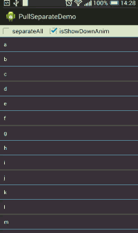

到达顶部或底部继续拉动时，实现Item间的相互分离，有两种模式：

1.全部分离的模式，即屏幕内所有Item都会分离

2.部分分离模式，以点击位置为分界点，部分item分离

##用法
在代码中

	PullSeparateListView lv = (PullSeparateListView) findViewById(R.id.pullExpandListView);
	//全部分离设置为true,部分分离设置为false。默认为false
	lv.setSeparateAll(true);

在`xml`中

	<com.chiemy.pullseparate.PullSeparateListView
        android:id="@+id/pullExpandListView1"
        android:layout_width="match_parent"
        android:layout_height="match_parent"
        android:layout_below="@+id/is_separateAll_cb"
		app:separate_all="true"
        >
    </com.chiemy.pullseparate.PullSeparateListView>

另外还添加了点击缩放的效果